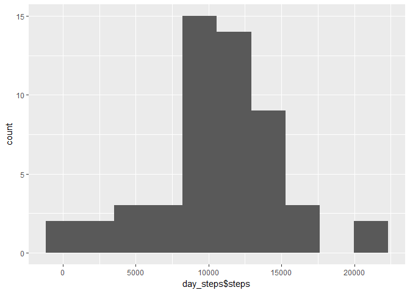
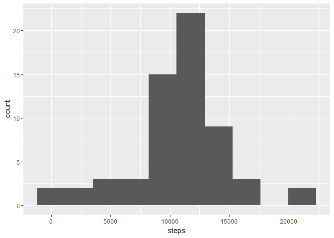
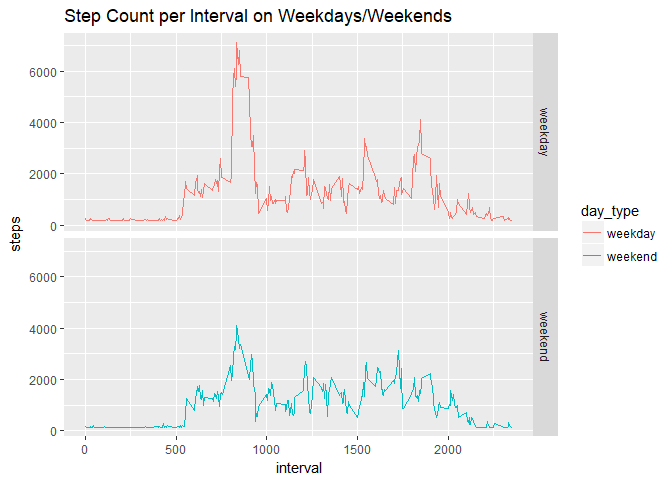

# Reproducible Research: Peer Assessment 1


## Loading and preprocessing the data


```r
setwd('E:/Dropbox/Code/datasciencecoursera/Reproducible Research/Course Project 1/RepData_PeerAssessment1')
activity_data <- read.csv('./activity/activity.csv')
complete_activity <- activity_data[complete.cases(activity_data), ]
complete_activity$date <- as.Date(as.factor(complete_activity$date))
str(complete_activity)
```

```
## 'data.frame':	15264 obs. of  3 variables:
##  $ steps   : int  0 0 0 0 0 0 0 0 0 0 ...
##  $ date    : Date, format: "2012-10-02" "2012-10-02" ...
##  $ interval: int  0 5 10 15 20 25 30 35 40 45 ...
```

## What is mean total number of steps taken per day?

```r
total_steps <- sum(complete_activity$steps)
print(paste("the total number of steps taken was", total_steps))
```

```
## [1] "the total number of steps taken was 570608"
```

```r
day_steps <- aggregate(steps ~ date, complete_activity, sum)
class(day_steps)
```

```
## [1] "data.frame"
```

```r
names(day_steps)
```

```
## [1] "date"  "steps"
```

```r
p <- ggplot(data = day_steps, aes(day_steps$steps)) + geom_histogram(bins=10)
print(p)
```

<!-- -->

```r
mean_steps <- mean(day_steps$steps)
median_steps <- median(day_steps$steps)

print(paste("the mean number of steps taken each day was", mean_steps))
```

```
## [1] "the mean number of steps taken each day was 10766.1886792453"
```

```r
print(paste("the median number of steps taken each day was", median_steps))
```

```
## [1] "the median number of steps taken each day was 10765"
```


## What is the average daily activity pattern?

```r
interval_steps <- aggregate(steps ~ interval, complete_activity, mean)
p <- ggplot(data = interval_steps, aes(x = interval, y = steps)) + geom_line()
print(p)
```

<!-- -->

```r
max_interval <- interval_steps[max(interval_steps$steps),]
print(paste("the interval that averages the maximum number of steps is", max_interval$interval))
```

```
## [1] "the interval that averages the maximum number of steps is 1705"
```


## Imputing missing values

```r
# count missing values
missing_values <- sum(colSums(is.na(activity_data)))
print(paste("there are", missing_values, "missing values in the activity data"))
```

```
## [1] "there are 2304 missing values in the activity data"
```

```r
# replace missing values
activity_data_filled <- activity_data
activity_data_filled$steps <- ifelse(is.na(activity_data_filled$steps), mean(activity_data_filled$steps, na.rm=TRUE), activity_data_filled$steps)

filled_day_steps <- aggregate(steps ~ date, data = activity_data_filled, sum)
p <- ggplot(data=filled_day_steps, aes(steps)) + geom_histogram(bins=10)
print(p)
```

<!-- -->

```r
filled_mean <- mean(filled_day_steps$steps)
filled_median <- median(filled_day_steps$steps)

print(paste("the mean when na's are filled is", filled_mean))
```

```
## [1] "the mean when na's are filled is 10766.1886792453"
```

```r
print(paste("the median when na's are filled is", filled_median))
```

```
## [1] "the median when na's are filled is 10766.1886792453"
```


## Are there differences in activity patterns between weekdays and weekends?

```r
activity_data_filled$date <- as.Date(as.factor(activity_data_filled$date))
activity_data_filled$weekday <- weekdays(x = activity_data_filled$date)
week_day <- c('Monday', 'Tuesday', 'Wednedsay', 'Thursday', 'Friday')
week_end <- c('Saturday', 'Sunday')
activity_data_filled$day_type <- ifelse(activity_data_filled$weekday %in% week_day,'weekday', 'weekend')

filled_day_steps_type <- aggregate(steps ~ interval+day_type, activity_data_filled, sum)

p <- ggplot(data=filled_day_steps_type, aes(x=interval, y=steps, color=day_type)) + geom_line() + facet_grid(day_type ~ .) + labs(title = "Step Count per Interval on Weekdays/Weekends")
print(p)
```

<!-- -->

There do appear differences between weekdays and weekends.
